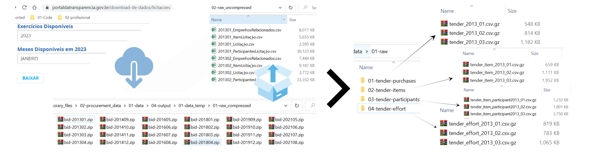

# 1: Introduction

This data project aims to clean the tender data from Brazil's federal public expenses, which can be found on the public [Transparency Portal](https://portaldatransparencia.gov.br/download-de-dados) (known as "Portal da transparência" in Portuguese). In Brazil, federal government purchases are managed through the SIASG system (short for "Sistema Integrado de Administração e Serviços Gerais" in Portuguese). The Transparency Portal provides access to a rich set of data information from SIASG, including the universe of the bidding process and contracts. 

This data project was conducted using the R programming language. It downloads monthly compressed data from the Transparency Portal and cleans the data by dividing it into five distinct datasets with standardized names and adjusted formats. The main outputs of this data project are the following datasets:

*  **01-tender-YYYY** - This is a yearly dataset containing information on the tender process level. It includes details about the bidding process, such as the tender method, total amount, bidding, buyer, and dates of opening and results. The unique id is the tender id which is a combination of buyer id + purchase method id + process tender id.
*  **02-tender-item-YYYY** -  This dataset contains information on the individual lots (items) that are in a tender. It includes details about each item, description, purchase quantity, estimated value, and winning bidder's information. The unique observation in this data is item_id + winner id, it is rare to found a lot with more than one winner but it is possible for framework agreement ( Pregão do tipo registro de preços)
*  **03-tender-participants-YYYY** -This dataset identifies each participant in a lot/tender, with competition occurring at the item or lot level.
*  **04-tender-efforts-YYYY** - This dataset contains data on "nota de empenho," a short invoice that precedes the purchase.
*  **05-ug_data** - This dataset includes information on the management unit responsible for the tender process. It contains details about the management unit, the organizing body, the top-level organization, and the location.

# 2: Code struture

The coding process is managed by a master R script named **01-Master_tender_data_harmonization.R**, which is responsible for the following tasks:

1. **Load packages** (Note: Rtools is required for R version 4.2 or higher).
2. **Define main file paths**.
3. **Create the project's folder structure**, if it doesn't already exist.
4. **Specify the time period for data cleaning**.
5. **Declare functions used throughout the project**.
6. **Execute all scripts in the correct order**, located in the "01-R_code" folder.

The scripts are divided into two categories:

- **Raw Organization**: These scripts download data and reorganize raw files into folders for each module, making it easier to manage the raw data.
- **Data Harmonization**: These scripts clean the dataset and standardize naming conventions for general use.location

## 2.1: Raw organization

The Raw Organization process consists of three separate scripts: "01-Download-porta_transparencia.r", "02-Tender-organization-raw.R", and "03-Deleting-extra-files.R". The figure below illustrates the entire process carried out by scripts 01, 02, and 03.

Utilizing gzip compression offers a significant advantage for data storage, as the compressed data can be read directly without decompression using the fread command from the data.table package. For example, the raw folder containing data from 2013 to 2022 has a size of 1.34 GB when compressed with gzip, while the uncompressed version occupies 23.3 GB of disk space.

###  01-Download-porta_transparencia.R
The script is divided into two parts. First, it downloads the monthly compressed data files from the specified [source](https://portaldatransparencia.gov.br/download-de-dados/licitacoes). Then, it extracts all the downloaded files into a designated folder.
  
###  02-Tender-organization-raw.R
The script processes each zip file containing four CSV files (tender, lot, participants, and effort). Given the initial disorganization, the script renames the data according to a specific pattern and sorts each of the four modules into their respective folders. Additionally, it compresses the files using gzip, significantly saving storage space. R is capable of reading these compressed files directly using the data.table package.
 
###  03-Deleting-extra-files.R
Since all files were already reorganized keeping all the original content, the raw downloaded and unzipped is deleted by this script to save space.

## 2.2: Data Harmonization
  The data harmonization process is responsible for standardizing names and labels along the data, checking duplications, adjusting data formats, and saving the harmonized data in the "import" folder in rds compressed format. To do it, we first create an auxiliary data "02-tender_rename_file.xlsx" that contains all the original names, original labels, and new ones. Using this Excel file, combine with the **rename** function and **!!set_names** operator creates a quick, elegant, and straightforward way to harmonize variable names along several datasets. Finally, for each data module, it is made an adjust for numeric variables and data formats.
  
###  04-Getting-all-variable-names-in-data. 
 This script reads the column names of the raw dataset for all years and months and saves them in an Excel file called "01-tender_base_colnames_to_rename.xlsx". This file is the basis for creating the renamed data in the "05-Harmonize-tender-data.R" script. The "02-tender_rename_file.xlsx" is manually created, with the original labels columns extracted from the  [dictionary](https://portaldatransparencia.gov.br/pagina-interna/603389-dicionario-de-dados-licitacoes). on the website. Once the "02-tender_rename_file.xlsx" is made, it is not necessary to rerun this code.

###  05-Harmonize-tender-data.R
  This central script harmonizes all data, creating five datasets as described in the introduction section. For each dataset, the process is as follows:
Create a loop by year.
Read all monthly files for the specified year.
Rename the files according to the "02-tender_rename_file.xlsx".
Adjust numeric variables by replacing commas with dots, converting them to numbers, and changing dates to the DMY format.
Check for data duplications and remove redundant variables (e.g., keeping only the managing unit ID and removing its name and characteristics, as they can be merged using the managing unit characteristics data).
All data generated by this script is saved in the "import" folder. It is important to note that the compressed RDS option saves the data, resulting in much smaller file sizes. Although it takes longer to read, the space saved is significant, and the commands to read the data (read_rds or readRDS) still function properly.

  
###  06-structures_and_stats.R
 
Finally, after cleanning the last code create an dictionary based on the label and names of the data. It includes a set of usefull statistics that allows us to understand if we have some inconsistency.

It generates the richfull structure that is on "02-documentation/01-architecture_tender.xlsx"

# 3: Others usefull informations

## 3.1 Sources for procurement data

* [Portal da transparência](https://www.portaltransparencia.gov.br/origem-dos-dados): A website that we have access to the the SIASG
federal expense composition. It allows to download data of tenders and contracts monthly. 
* [Compras dados](http://compras.dados.gov.br/): It is a website that allows to download almost every piece of information in the tender procces. However,
it is quite more difficult to download the data.
* SIASG datawarehouse: this is the original source that has restrict access.

## 3.2 Product Classification 
The procurement processes dataset and the contracts dataset contain detailed information on purchased items. Items are classified using the CATSER (catálogo de serviços) catalog for service, and the CATMAT (catálogo de materiais) catalog for goods.  Using these classifications, it is possible categorizes items in some agreagation level. 

Download option:
* [CATMAT/CATSER](https://www.gov.br/compras/pt-br/acesso-a-informacao/consulta-detalhada/planilha-catmat-catser): www.gov.br
* [CATMAT](http://compras.dados.gov.br/docs/lista-metodos-materiais.html): compras.dados.gov
* [CATSER](http://compras.dados.gov.br/docs/lista-metodos-servicos.html): compras.dados.gov

### [CATMAT](https://www.gov.br/saude/pt-br/acesso-a-informacao/gestao-do-sus/economia-da-saude/banco-de-precos-em-saude/catalogo-de-materiais-2013-catmat)
  Goods are detailed up to 6 digits levels. The materials are classifications that are aggregable by 2, 3, and 5 digits level.
https://www.gov.br/compras/pt-br/acesso-a-informacao/consulta-detalhada/planilha-catmat-catser/view 

### [CATSER](http://compras.dados.gov.br/): 
  Services are detailed up to 5 digits levels. The materials are classifications that are aggregable by 1, 2, 3, and 4 digits level.

